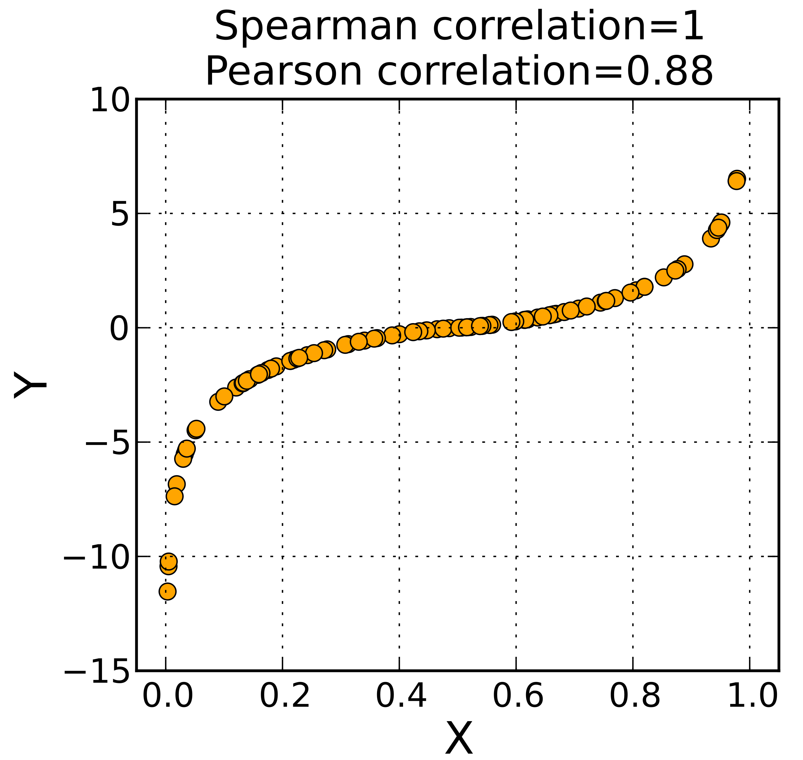
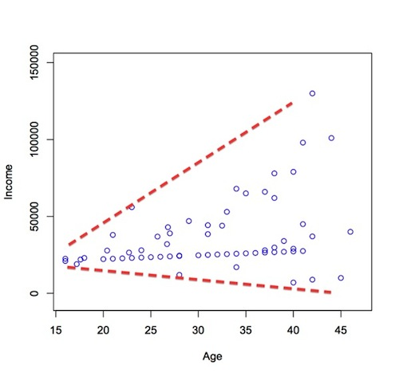
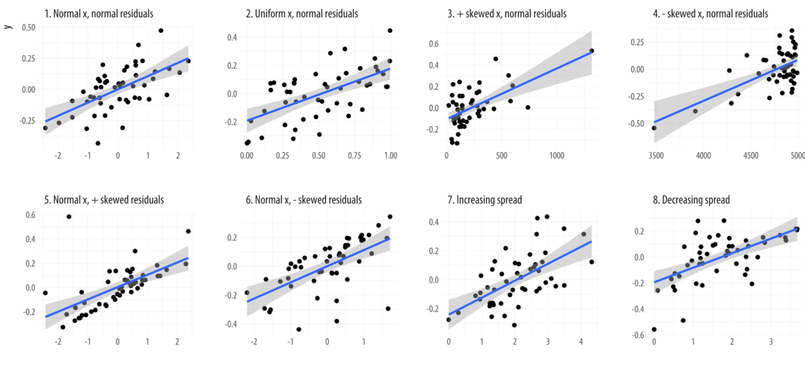
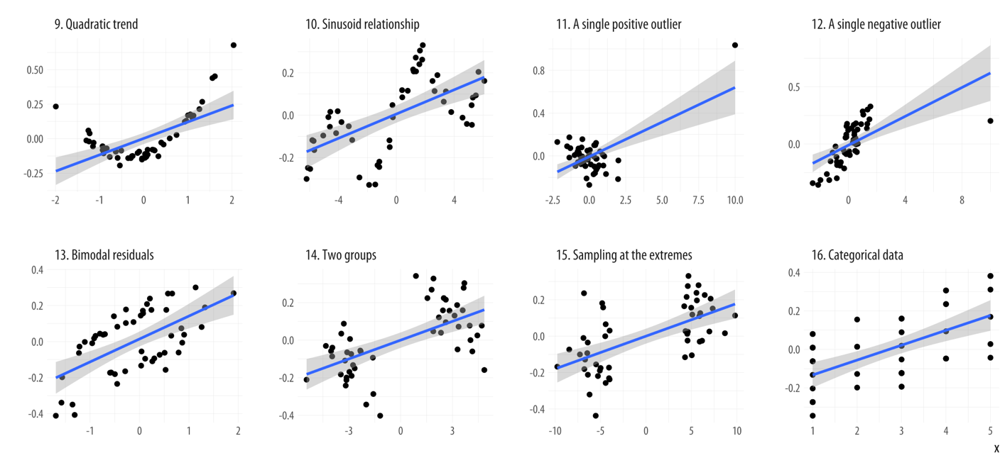

```{r setup, include=FALSE}
library(plyr)
library(tidyverse)
library(datasets)
library(kableExtra)
library(purrr)
library(scales)
library(forecast)
library(EnvStats)
library(gghighlight)
library(jmv)
library(ggpubr)
options(htmltools.dir.version = FALSE)
knitr::opts_chunk$set(cache = FALSE, fig.align = "center", dev = "png", fig.retina = 2, message = FALSE)
theme_set(theme_gray(base_size=16))

```


# Übersicht

1. .gray[Was sind Methoden?] => [Link](lecture01.html) $\checkmark$
2. .gray[Qualitative und Quantitative Daten? Forschungsfrage wählen] => [Link](lecture02.html) $\checkmark$
3. .gray[Wissenschaftstheorie, Empirie und Theorie] => [Link](lecture03.html) $\checkmark$
4. .gray[Forschungsintstrument entwickeln, Messtheorie, Skalenniveaus] => [Link](lecture04.html) $\checkmark$
5. .gray[Deskriptive Statistik, zentrale Tendenz und Streuung] => [Link](lecture05.html) $\checkmark$
6. .gray[Verteilungen, Stichproben und Wahrscheinlichkeit] => [Link](lecture06.html) $\checkmark$
7. .gray[Inferenz, Hypothesen, Fehler 1. und 2. Art, t-Test] => [Link](lecture07.html) $\checkmark$
8. .gray[Alpha-Fehler Kummulierung, ANOVA, MANOVA, Bonferroni] => [Link](lecture08.html)
9. **Zusammenhänge, Korrelation, lineare Regression** => [Link](lecture09.html)
10. Skalen, Likert-Skalen, Reliabilität und Faktoren-Analyse => [Link](lecture10.html)
11. Explorative Statistik, parametrische und nicht-parametrische Verfahren => [Link](lecture11.html)
12. Conjoint-Verfahren, Cluster-Analyse => [Link](lecture12.html)
13. Effekt-Stärken und Poweranalyse => [Link](lecture13.html)

---
# Wiederholung

---

# T-Test und Inferenz

- Was ist Inferenz? Schließen von Stichprobe auf Grundgesamtheit.

- NHST Test-Verfahren zum prüfen einer Hypothese. 
- Hypothesen ( $H_{0}$ und $H_1$ )
- Nur $H_0$ kann verworfen werden.
- Signifikanz-Niveau $\alpha$
- Test-Statistik (t) und p-Wert prüfen.

- $\alpha$-Fehler und $\beta$-Fehler

3 Varianten t-Tests zum Prüfen von Unterschiedshypothesen
- einfacher t-Test, independent sample t-Test, paired sample t-Test

---

# Unterschiedshypothesen

> Gibt es einen Unterschied zwischen...

##Der t-Test für
- 2 Gruppen (within oder between subjects)
- Normalverteilte abhängige Variable

## Mehrere Hypothesen
- Varianzanalyse (ANOVA)
- One-way oder two-way
- Mit oder ohne Covariate (ANCOVA)
- Mehrere Abhängige (MANCOVA)


---
# Univariate und Multivariate Statistik

.pull-left[
## Univariate
```{r, echo=F, fig.height=5}
set.seed(0)
height <- round(rnorm(100,170,15),1)
df_uni <- data.frame(height)
head(df_uni,10)
ggplot(df_uni) + aes(height) + geom_histogram(bins=10, fill="black")
```
]

--

.pull-right[
## Multivariate
```{r, echo=F, fig.height=5}
shoesize <- runif(100, 36, 42)
df_multi <- data.frame(height, 
                       shoesize)
head(df_multi,10)
ggplot(df_uni) + aes(height, shoesize) + geom_point(size=3, alpha=0.8)
```
]

---
# Multivariate
```{r, echo=F}

# Scatter plot colored by groups ("Species")
sp <- ggscatter(df_multi, x = "height", y = "shoesize",
                        size = 3, alpha = 0.8) + border()                                         

# Marginal density plot of x (top panel) and y (right panel)
xplot <- gghistogram(df_multi, x = "height", bins=10, fill="black")
yplot <- gghistogram(df_multi, x = "shoesize", bins=10, fill="black")+ rotate()
# Cleaning the plots
sp <- sp + rremove("legend")
yplot <- yplot + clean_theme() + rremove("legend") 
xplot <- xplot + clean_theme() + rremove("legend")
# Arranging the plot using cowplot
library(cowplot)
plot_grid(xplot, NULL, sp, yplot, ncol = 2, align = "hv", 
      rel_widths = c(2, 1), rel_heights = c(1, 2))
```

---
# Zusammenhangshypothesen

> Gibt es einen Zusammenhang zwischen... (je mehr, desto..)

```{r, echo=FALSE, warning=FALSE}
df_sigma <- matrix(c(2,1,1,2), nrow = 2)
df <- MASS::mvrnorm(100, c(3,3), df_sigma, empirical = T)

df <- data.frame(df)

sp <- ggscatter(df, x = "X1", y = "X2",
                        size = 3, alpha = 0.8) + border()
sp


```
---
# Zusammenhangshypothesen

> Gibt es einen Zusammenhang zwischen... (je mehr, desto..)

```{r, echo=FALSE, warning=FALSE}
df_sigma <- matrix(c(2,1,1,2), nrow = 2)
df_data <- MASS::mvrnorm(100, c(3,3), df_sigma, empirical = T)

df_data <- data.frame(df_data)

sp <- ggscatter(df_data, x = "X1", y = "X2",
                        size = 3, alpha = 0.8) + border()                                         

# Marginal density plot of x (top panel) and y (right panel)
xplot <- gghistogram(df_data, x = "X1", bins=10, fill="black")
yplot <- gghistogram(df_data, x = "X2", bins=10, fill="black")+ rotate()
# Cleaning the plots
sp <- sp + rremove("legend")
yplot <- yplot + clean_theme() + rremove("legend") 
xplot <- xplot + clean_theme() + rremove("legend")
# Arranging the plot using cowplot
library(cowplot)
plot_grid(xplot, NULL, sp, yplot, ncol = 2, align = "hv", 
      rel_widths = c(2, 1), rel_heights = c(1, 2))


```


---
# Varianz und Covarianz

$$ VAR(X) = \frac{1}{N} \sum_{i=1}^{N}{(x_i - \bar{x})^2} $$
Varianz ist die mittlere quadratische Abweichung vom Mittelwert.

--

Covarianz ist "mittlere" Abweichung zweier verbundener Variablen vom verbundenen Mittelwert.

$$COV_{xy} = \frac{1}{N-1} \sum_{i=1}^{N}{(x_{i} - \bar{x})(y_{i} - \bar{y})}$$
---
# Einfaches Beispiel

2 Variablen: x, y

3 Werte: je 2,4,6

```{r, echo=F}
df_pos <- data.frame(x=c(2,4,6), y=c(2,4,6))
kable(df_pos, row.names = T)
```


---
# Visuelle Interpretation
$$\bar{x}=$$
$$\bar{y}=$$

```{r echo=F, fig.height=5, fig.width=5}
df_pos <- data.frame(x=c(2,4,6), y=c(2,4,6))
ggscatter(df_pos, x="x", y="y", color="red", size=4) + lims(x=c(0,8), y=c(0,8))


```


---
# Visuelle Interpretation
$$\bar{x}=\frac{1}{3} (2+4+6) = 4 $$
$$\bar{y}=$$

```{r echo=F, fig.height=5, fig.width=5}

ggscatter(df_pos, x="x", y="y", color="red", size=4) + lims(x=c(0,8), y=c(0,8))


```


---
# Visuelle Interpretation
$$\bar{x}=\frac{1}{3} (2+4+6) = 4 $$
$$\bar{y}=$$

```{r echo=F, fig.height=5, fig.width=5}

ggscatter(df_pos, x="x", y="y", color="red", size=4) + lims(x=c(0,8), y=c(0,8)) + geom_vline(xintercept = 4)


```

---
# Visuelle Interpretation
$$\bar{x}=\frac{1}{3} (2+4+6) = 4 $$
$$\bar{y}=\frac{1}{3} (2+4+6) = 4$$

```{r echo=F, fig.height=5, fig.width=5}
ggscatter(df_pos, x="x", y="y", color="red", size=4) + lims(x=c(0,8), y=c(0,8)) + geom_vline(xintercept = 4) + geom_hline(yintercept = 4)
```


---
# Visuelle Interpretation
$$\bar{x}= 4 $$
$$\bar{y}= 4$$

```{r echo=F, fig.height=5, fig.width=5}
ggscatter(df_pos, x="x", y="y", color="red", size=4) + lims(x=c(0,8), y=c(0,8)) +
  geom_point(data=data.frame(x=4, y=4), aes(x=x, y=y), size = 10, alpha=0.4) 
```

---
# Visuelle Interpretation
$$\bar{x}= 4 \text{ und } \bar{y}= 4$$
$$COV_{xy} = \frac{1}{N-1} \sum_{i=1}^{N}{(x_{i} - \bar{x})(y_{i} - \bar{y})}$$

```{r echo=F, fig.height=5, fig.width=5}
ggscatter(df_pos, x="x", y="y", color="red", size=4) + lims(x=c(0,8), y=c(0,8)) +
  geom_point(data=data.frame(x=4, y=4), aes(x=x, y=y), size = 10, alpha=0.4) 
```

---
# Visuelle Interpretation
$$COV_{xy} = \frac{1}{2} \sum_{i=1}^{3}{(x_{i} - 4)(y_{i} - 4)}$$ 
--

$$= \frac{1}{2}( (x_1-4)(y_1-4) + (x_2-4)(y_2-4) + (x_3-4)(y_3-4))$$

```{r echo=F, fig.height=5, fig.width=5}
ggscatter(df_pos, x="x", y="y", color="red", size=4) + lims(x=c(0,8), y=c(0,8)) +
  geom_point(data=data.frame(x=4, y=4), aes(x=x, y=y), size = 10, alpha=0.4) 
```


---
# Visuelle Interpretation
$$COV_{xy} = \frac{1}{N-1} \sum_{i=1}^{N}{\color{red}{(x_{i} - \bar{x})}(y_{i} - \bar{y})}$$

```{r echo=F, fig.height=5, fig.width=5}
ggscatter(df_pos, x="x", y="y", color="red", size=4) + lims(x=c(0,8), y=c(0,8)) +
  geom_point(data=data.frame(x=4, y=4), aes(x=x, y=y), size = 10, alpha=0.4) + 
  geom_vline(xintercept = 4, linetype="dashed") + geom_hline(yintercept = 4, linetype="dashed") +
  geom_line(data=data.frame(x=c(2,4), y=c(2,2)), color = "red") 
```
---
# Visuelle Interpretation
$$COV_{xy} = \frac{1}{N-1} \sum_{i=1}^{N}{\color{red}{(x_{i} - \bar{x})}(y_{i} - \bar{y})}$$

```{r echo=F, fig.height=5, fig.width=5}
ggscatter(df_pos, x="x", y="y", color="red", size=4) + lims(x=c(0,8), y=c(0,8)) +
  geom_point(data=data.frame(x=4, y=4), aes(x=x, y=y), size = 10, alpha=0.4) + 
  geom_vline(xintercept = 4, linetype="dashed") + geom_hline(yintercept = 4, linetype="dashed") +
  geom_line(data=data.frame(x=c(2,4), y=c(2,2)), color = "red") +
  geom_label(data= data.frame(label=c("-2"), x=c(3), y=c(1.5)), aes(label=label, x=x, y=y), size=7)
```

---
# Visuelle Interpretation
$$COV_{xy} = \frac{1}{N-1} \sum_{i=1}^{N}{\color{red}{(x_{i} - \bar{x})}\color{blue}{(y_{i} - \bar{y})}}$$

```{r echo=F, fig.height=5, fig.width=5}
ggscatter(df_pos, x="x", y="y", color="red", size=4) + lims(x=c(0,8), y=c(0,8)) +
  geom_point(data=data.frame(x=4, y=4), aes(x=x, y=y), size = 10, alpha=0.4) + 
  geom_vline(xintercept = 4, linetype="dashed") + geom_hline(yintercept = 4, linetype="dashed") +
  geom_line(data=data.frame(x=c(2,4), y=c(2,2)), color = "red") +
  geom_line(data=data.frame(x=c(2,2), y=c(2,4)), color = "blue") +
  geom_label(data= data.frame(label=c("-2", "-2"), x=c(3,1.5), y=c(1.5,3)), aes(label=label, x=x, y=y), size=7)
```

---
# Visuelle Interpretation
$$COV_{xy} = \frac{1}{N-1} \sum_{i=1}^{N}{\color{red}{(x_{i} - \bar{x})}\color{blue}{(y_{i} - \bar{y})}}$$
$$ = \frac{1}{2}( \color{red}{-2} \cdot \color{blue}{-2} + \ldots = \frac{1}{2}( 4 + \ldots$$

```{r echo=F, fig.height=5, fig.width=5}
ggscatter(df_pos, x="x", y="y", color="red", size=4) + lims(x=c(0,8), y=c(0,8)) +
  geom_point(data=data.frame(x=4, y=4), aes(x=x, y=y), size = 10, alpha=0.4) + 
  geom_vline(xintercept = 4, linetype="dashed") + geom_hline(yintercept = 4, linetype="dashed") +
  geom_line(data=data.frame(x=c(2,4), y=c(2,2)), color = "red") +
  geom_line(data=data.frame(x=c(2,2), y=c(2,4)), color = "blue") +
  geom_label(data= data.frame(label=c("-2", "-2"), x=c(3,1.5), y=c(1.5,3)), aes(label=label, x=x, y=y), size=7)
```


---
# Visuelle Interpretation
$$COV_{xy} = \frac{1}{N-1} \sum_{i=1}^{N}{\color{red}{(x_{i} - \bar{x})}\color{blue}{(y_{i} - \bar{y})}}$$
$$ = \frac{1}{2}( \color{red}{-2} \cdot \color{blue}{-2} + 0 +\ldots = \frac{1}{2}( 4 + 0 + \ldots$$

```{r echo=F, fig.height=5, fig.width=5}
ggscatter(df_pos, x="x", y="y", color="red", size=4) + lims(x=c(0,8), y=c(0,8)) +
  geom_point(data=data.frame(x=4, y=4), aes(x=x, y=y), size = 10, alpha=0.4) + 
  geom_vline(xintercept = 4, linetype="dashed") + geom_hline(yintercept = 4, linetype="dashed") +
  geom_line(data=data.frame(x=c(2,4), y=c(2,2)), color = "red") +
  geom_line(data=data.frame(x=c(2,2), y=c(2,4)), color = "blue") +
  geom_label(data= data.frame(label=c("-2", "-2"), x=c(3,1.5), y=c(1.5,3)), aes(label=label, x=x, y=y), size=7)
```


---
# Visuelle Interpretation
$$COV_{xy} = \frac{1}{N-1} \sum_{i=1}^{N}{\color{red}{(x_{i} - \bar{x})}\color{blue}{(y_{i} - \bar{y})}}$$
$$ = \frac{1}{2}( \color{red}{-2} \cdot \color{blue}{-2} + 0 +\ldots = \frac{1}{2}( 4 + 0 + \ldots$$

```{r echo=F, fig.height=5, fig.width=5}
ggscatter(df_pos, x="x", y="y", color="red", size=4) + lims(x=c(0,8), y=c(0,8)) +
  geom_point(data=data.frame(x=4, y=4), aes(x=x, y=y), size = 10, alpha=0.4) + 
  geom_vline(xintercept = 4, linetype="dashed") + geom_hline(yintercept = 4, linetype="dashed") +
  geom_line(data=data.frame(x=c(2,4), y=c(2,2)), color = "red") +
  geom_line(data=data.frame(x=c(2,2), y=c(2,4)), color = "blue") +
  geom_label(data= data.frame(label=c("-2", "-2"), x=c(3,1.5), y=c(1.5,3)), aes(label=label, x=x, y=y), size=7) +
   geom_line(data=data.frame(x=c(4,6), y=c(6,6)), color = "red") +
  geom_line(data=data.frame(x=c(6,6), y=c(6,4)), color = "blue") 
```

---
# Visuelle Interpretation
$$COV_{xy} = \frac{1}{N-1} \sum_{i=1}^{N}{\color{red}{(x_{i} - \bar{x})}\color{blue}{(y_{i} - \bar{y})}}$$
$$ = \frac{1}{2}( \color{red}{-2} \cdot \color{blue}{-2} + 0 +\color{red}{2} \cdot \color{blue}{2} ) = \frac{1}{2}( 4 + 0 + 4) = \frac{8}{2} = 4$$

```{r echo=F, fig.height=5, fig.width=5}
ggscatter(df_pos, x="x", y="y", color="red", size=4) + lims(x=c(0,8), y=c(0,8)) +
  geom_point(data=data.frame(x=4, y=4), aes(x=x, y=y), size = 10, alpha=0.4) + 
  geom_vline(xintercept = 4, linetype="dashed") + geom_hline(yintercept = 4, linetype="dashed") +
  geom_line(data=data.frame(x=c(2,4), y=c(2,2)), color = "red") +
  geom_line(data=data.frame(x=c(2,2), y=c(2,4)), color = "blue") +
  geom_label(data= data.frame(label=c("-2", "-2"), x=c(3,1.5), y=c(1.5,3)), aes(label=label, x=x, y=y), size=7) +
   geom_line(data=data.frame(x=c(4,6), y=c(6,6)), color = "red") +
  geom_line(data=data.frame(x=c(6,6), y=c(6,4)), color = "blue") +
  geom_label(data= data.frame(label=c("2", "2"), x=c(6.5,5), y=c(5,6.5)), aes(label=label, x=x, y=y), size=7)
```

---
# Kann das R auch ?
```{r}
cov(df_pos$x, df_pos$y)
```
---
# Einfaches Beispiel 2

2 Variablen: x, y

3 Werte: je 2,4,6

```{r, echo=F}
df_pos <- data.frame(x=c(2,4,6), y=c(6,4,2))
kable(df_pos, row.names = T)
```

---
# Visuelle Interpretation
$$\bar{x}= 4 $$
$$\bar{y}= 4$$

```{r echo=F, fig.height=5, fig.width=5}
ggscatter(df_pos, x="x", y="y", color="red", size=4) + lims(x=c(0,8), y=c(0,8)) +
  geom_point(data=data.frame(x=4, y=4), aes(x=x, y=y), size = 10, alpha=0.4) 
```

---
# Visuelle Interpretation
$$COV_{xy} = \frac{1}{N-1} \sum_{i=1}^{N}{\color{red}{(x_{i} - \bar{x})}(y_{i} - \bar{y})}$$

```{r echo=F, fig.height=5, fig.width=5}
ggscatter(df_pos, x="x", y="y", color="red", size=4) + lims(x=c(0,8), y=c(0,8)) +
  geom_point(data=data.frame(x=4, y=4), aes(x=x, y=y), size = 10, alpha=0.4) + 
  geom_vline(xintercept = 4, linetype="dashed") + geom_hline(yintercept = 4, linetype="dashed") +
  geom_line(data=data.frame(x=c(2,4), y=c(6,6)), color = "red") 
```


---
# Visuelle Interpretation
$$COV_{xy} = \frac{1}{N-1} \sum_{i=1}^{N}{\color{red}{(x_{i} - \bar{x})}(y_{i} - \bar{y})}$$

```{r echo=F, fig.height=5, fig.width=5}
ggscatter(df_pos, x="x", y="y", color="red", size=4) + lims(x=c(0,8), y=c(0,8)) +
  geom_point(data=data.frame(x=4, y=4), aes(x=x, y=y), size = 10, alpha=0.4) + 
  geom_vline(xintercept = 4, linetype="dashed") + geom_hline(yintercept = 4, linetype="dashed") +
  geom_line(data=data.frame(x=c(2,4), y=c(6,6)), color = "red") +
  geom_label(data= data.frame(label=c("-2"), x=c(3), y=c(6.5)), aes(label=label, x=x, y=y), size=7)
```

---
# Visuelle Interpretation
$$COV_{xy} = \frac{1}{N-1} \sum_{i=1}^{N}{\color{red}{(x_{i} - \bar{x})}\color{blue}{(y_{i} - \bar{y})}}$$

```{r echo=F, fig.height=5, fig.width=5}
ggscatter(df_pos, x="x", y="y", color="red", size=4) + lims(x=c(0,8), y=c(0,8)) +
  geom_point(data=data.frame(x=4, y=4), aes(x=x, y=y), size = 10, alpha=0.4) + 
  geom_vline(xintercept = 4, linetype="dashed") + geom_hline(yintercept = 4, linetype="dashed") +
  geom_line(data=data.frame(x=c(2,4), y=c(6,6)), color = "red") +
  geom_line(data=data.frame(x=c(2,2), y=c(4,6)), color = "blue") +
  geom_label(data= data.frame(label=c("-2", "2"), x=c(3,1.5), y=c(6.5,5)), aes(label=label, x=x, y=y), size=7)
```

---
# Visuelle Interpretation
$$COV_{xy} = \frac{1}{N-1} \sum_{i=1}^{N}{\color{red}{(x_{i} - \bar{x})}\color{blue}{(y_{i} - \bar{y})}}$$
$$ = \frac{1}{2}( \color{red}{-2} \cdot \color{blue}{2} + \ldots = \frac{1}{2}( -4 + \ldots$$

```{r echo=F, fig.height=5, fig.width=5}
ggscatter(df_pos, x="x", y="y", color="red", size=4) + lims(x=c(0,8), y=c(0,8)) +
  geom_point(data=data.frame(x=4, y=4), aes(x=x, y=y), size = 10, alpha=0.4) + 
  geom_vline(xintercept = 4, linetype="dashed") + geom_hline(yintercept = 4, linetype="dashed") +
  geom_line(data=data.frame(x=c(2,4), y=c(6,6)), color = "red") +
  geom_line(data=data.frame(x=c(2,2), y=c(4,6)), color = "blue") +
  geom_label(data= data.frame(label=c("-2", "2"), x=c(3,1.5), y=c(6.5,5)), aes(label=label, x=x, y=y), size=7)
```

---
# Visuelle Interpretation
$$COV_{xy} = \frac{1}{N-1} \sum_{i=1}^{N}{\color{red}{(x_{i} - \bar{x})}\color{blue}{(y_{i} - \bar{y})}}$$
$$ = \frac{1}{2}( \color{red}{-2} \cdot \color{blue}{2} + 0 +\color{red}{2} \cdot \color{blue}{2} ) = \frac{1}{2}( -4 + 0 + (-4)) = -\frac{8}{2} = -4$$

```{r echo=F, fig.height=5, fig.width=5}
ggscatter(df_pos, x="x", y="y", color="red", size=4) + lims(x=c(0,8), y=c(0,8)) +
  geom_point(data=data.frame(x=4, y=4), aes(x=x, y=y), size = 10, alpha=0.4) + 
  geom_vline(xintercept = 4, linetype="dashed") + geom_hline(yintercept = 4, linetype="dashed") +
  geom_line(data=data.frame(x=c(2,4), y=c(6,6)), color = "red") +
  geom_line(data=data.frame(x=c(2,2), y=c(4,6)), color = "blue") +
  geom_label(data= data.frame(label=c("-2", "2"), x=c(3,1.5), y=c(6.5,5)), aes(label=label, x=x, y=y), size=7) +
   geom_line(data=data.frame(x=c(4,6), y=c(2,2)), color = "red") +
  geom_line(data=data.frame(x=c(6,6), y=c(2,4)), color = "blue") +
  geom_label(data= data.frame(label=c("-2", "2"), x=c(6.5,5), y=c(3,1.5)), aes(label=label, x=x, y=y), size=7)
```

---
# Kann das R auch ?
```{r}
cov(df_pos$x, df_pos$y)
```

---
# Was passiert bei Veränderung?
$$COV_{xy} = \frac{1}{N-1} \sum_{i=1}^{N}{\color{red}{(x_{i} - \bar{x})}\color{blue}{(y_{i} - \bar{y})}}$$
$$ = \frac{1}{2}( \color{red}{-2} \cdot \color{blue}{2} + 0 +\color{red}{2} \cdot \color{blue}{2} ) = \frac{1}{2}( -4 + 0 + (-4)) = -\frac{8}{2} = -4$$

```{r echo=F, fig.height=5, fig.width=5}
ggscatter(df_pos, x="x", y="y", color="red", size=4) + lims(x=c(0,8), y=c(0,8)) +
  geom_point(data=data.frame(x=4, y=4), aes(x=x, y=y), size = 10, alpha=0.4) + 
  geom_vline(xintercept = 4, linetype="dashed") + geom_hline(yintercept = 4, linetype="dashed") +
  geom_line(data=data.frame(x=c(2,4), y=c(6,6)), color = "red") +
  geom_line(data=data.frame(x=c(2,2), y=c(4,6)), color = "blue") +
  geom_label(data= data.frame(label=c("-2", "2"), x=c(3,1.5), y=c(6.5,5)), aes(label=label, x=x, y=y), size=7) +
   geom_line(data=data.frame(x=c(4,6), y=c(2,2)), color = "red") +
  geom_line(data=data.frame(x=c(6,6), y=c(2,4)), color = "blue") +
  geom_label(data= data.frame(label=c("-2", "2"), x=c(6.5,5), y=c(3,1.5)), aes(label=label, x=x, y=y), size=7)
```

---
# Covarianz ist beschreibt einen Zusammenhang
- positiv, wenn gilt: je mehr, desto mehr
- negativ, wenn gilt: je mehr, desto weniger

Die Covarianz hängt ab von der Streuung in beide Richtungen: 
- $VAR(X)$
- $VAR(Y))$
- Große Streuung => große Covarianz

---
# Beschreibung eines Zusammenhangs
- Covarianz (hängt von beiden Streuungen ab)
- Korrelation (rechnet die Streuung als Standardabwichung wieder raus)

--

$$ r = \frac{COV(XY)}{\sqrt{VAR(X)} \sqrt{VAR(Y)} } = \frac{COV(XY)}{SD(X) SD(Y)} $$

```{r}
cov(df_pos$x, df_pos$y)
sd(df_pos$x)
sd(df_pos$y)
```
--

```{r}
cor(df_pos$x, df_pos$y)
```

---
# Pearson Moment Korrelation
- wird mit $r$ beschrieben
- $r$ ist der Korrelationskoeffizient
- $r$ liegt immer zwischen -1 und 1

Vorraussetzung:
- beide Variablen sind normalverteilt

--


---
# Hypothesentest mit R
.pull-left[
```{r, echo=F, fig.height=5}
shoesize <- runif(100, 36, 42)
df_multi <- data.frame(height, 
                       shoesize)

ggplot(df_multi) + aes(height, shoesize) + geom_point(size=3, alpha=0.8)
```
]

--

.pull-right[
```{r}
cor.test(data=df_multi, 
         ~height+shoesize)
```
 ]

Es gibt keinen signifikanten Zusammenhang zwischen Körpergröße und Schuhgröße ( $r(98)=.042, p=.678$ ).

---
# Alternativen
## Was tun, wenn Daten nicht normalverteilt sind?
- Spearman Rangkorrelation: $\rho$ (gr. rho)

--

```{r, warning=F}
cor.test(data=df_multi, 
         ~height+shoesize, method="spearman")
```

--

Es gibt keinen signifikanten Zusammenhang zwischen Schuhgröße und Körpergröße ( $\rho=0.03, p=.7967$ ).

---


---
# Alternativen 2
## Was tun, wenn Daten nicht intervallskaliert sind?

--
- Kendall's tau Rangkorrelation: $\tau$ 


--

```{r, warning=F}
cor.test(data=df_multi, 
         ~height+round(shoesize), method="kendall")
```

--

Es gibt keinen signifikanten Zusammenhang zwischen Schuhgröße und Körpergröße ( $\tau=0.01, p=.8557$ ).

---
# Zusammenfassung
- Korrelation zum Beschreiben und Testen von Zusammenhängen
- Korrelationskoeffizient beschreibt "Stärke" des Zusammenhangs ( $r \in [-1;1]$)
- Je nach Vorraussetzung, unterschiedliche Verfahren.

## Korrelationstabelle

```{r, echo=F}
library(jmv)
jmv::corrMatrix(data = hcictools::robot_care, vars = c("robo_bed", "robo_food", "robo_med"))
```

---
class: inverse, center, middle
## .yellow[Korrelationen können nicht für die Vorhersage genutzt werden.]


---
# Vorhersage von Zusammenhängen

## Terminologie
- abhängige Variable: Zielvariable, soll vorhergesagt werden
- unabhägnige Variable, Prädiktor: Eingangsvariable, die für die Vorhersage verwendet werden soll.

--

## Lineares Modell
- Wir beschreiben typischer weise "lineare" Zusammenhänge
- Je mehr $a$, desto mehr $b$.

--

Beispiel:

- Je größer die Person, desto größer die Füße.
- Pro cm Körpergröße, erwarten wir mit x cm Fußlänge.

---
# Lineares Modell

## Lineare Gleichung
$$ y = b \cdot x + b_0 + \epsilon $$
- $y$ = abhängige Variable (hier: Fußlänge)
- $x$ = unabhängige Variable (hier: Körpergröße)
- $b, b_0$ = Koeffizienten (slope)
- $b_0$ = Intercept (y-Achsenabschnitt)
- $\epsilon$ = Fehlerterm 

---
# Beispiel:

$$ y = 0.75 \cdot x + 1 + \epsilon $$

```{r, echo = F}
ggplot(data=data.frame()) + geom_abline(slope= 0.75, intercept = 1, linetype="dashed") + lims(x=c(-20,20), y=c(-20,20)) + geom_hline(yintercept = 0) + geom_vline(xintercept = 0) + labs(x="x", y="y") +
  geom_label(data=data.frame(label = "intercept = 1", x=0, y=0.8), aes(label=label, x=x, y=y), size=7) +
  geom_label(data=data.frame(label = "slope = 0.75", x=10, y=11), aes(label=label, x=x, y=y), size=7) +
  NULL

```

---
# Vorhersage von Daten mit linearer Regression

```{r, echo=FALSE, warning=F}
df <- data.frame(df)
df_sub <- df[1:10,]


model <- lm(data =df_sub, X2~X1)

coef_c <- model$coefficients[1]
coef_b <- model$coefficients[2]

plotformatter <- list(
  aes(X1, X2),
  geom_point(na.rm = T),
  labs(x = "X Variable", y = "Y Variable"),
  lims(x=c(0,6), y=c(-2,5)),
  labs(title="Lineare Regression")
)


df_sub %>% ggplot() +plotformatter 

```

---
# Vorhersage von Daten mit linearer Regression
```{r, echo=FALSE, warning=F}
(df_sub %>% ggplot() +  
  geom_abline(slope = coef_b, intercept = coef_c, color="blue") + 
  plotformatter +
  #geom_text(label=paste("Steigung:", round(coef_b, digits = 2)), x=3, y=2, size = 7, nudge_y = 1) +
  NULL -> p)

```

---
# Vorhersage von Daten mit linearer Regression

```{r, echo=F, warning=F}
p2 <- p
for(i in 1:10){

  x1 <- df_sub[i,1]
  y1 <- df_sub[i,2]

  y2 <- predict(model, data.frame(X1=x1))
  ydiff <- y1 -y2
  p2 <- p2 + geom_line(data=data.frame(x=c(x1,x1), y=c(y1,y2)), 
                     aes(x=x, y=y, group=i), color = "blue", inherit.aes = F)
}
p2

```


---
# Vorhersage von Daten mit linearer Regression

```{r, echo=F, warning=F}
p2 <- p
for(i in 1:10){

  x1 <- df_sub[i,1]
  y1 <- df_sub[i,2]

  y2 <- predict(model, data.frame(X1=x1))
  ydiff <- y1 -y2
  p2 <- p2 + geom_line(data=data.frame(x=c(x1,x1), y=c(y1,y2)), 
                     aes(x=x, y=y, group=i), color = "blue", inherit.aes = F)
  p2 <- p2 + geom_label(label = paste("", round(ydiff,2)), x=x1, y=y2+(y1-y2)/2)
}
p2

```

---
# Vorhersage von Daten mit linearer Regression

```{r, echo=F, warning=F}
p2 <- p
sum_y <- 0
for(i in 1:10){

  x1 <- df_sub[i,1]
  y1 <- df_sub[i,2]

  y2 <- predict(model, data.frame(X1=x1))
  ydiff <- y1 -y2
  sum_y <- sum_y + ydiff
  p2 <- p2 + geom_line(data=data.frame(x=c(x1,x1), y=c(y1,y2)), 
                     aes(x=x, y=y, group=i), color = "blue", inherit.aes = F)
  p2 <- p2 + geom_label(label = paste("", round(ydiff,2)), x=x1, y=y2+(y1-y2)/2)
  p3 <- p2 + geom_label(label = paste("SUM:", round(sum_y,3) ), x=5, y=0, size=8)
}
p3

```

---
# Vorhersage von Daten mit linearer Regression

```{r, echo=F, warning=F}
p2 <- p
sum_y <- 0
for(i in 1:10){

  x1 <- df_sub[i,1]
  y1 <- df_sub[i,2]

  y2 <- predict(model, data.frame(X1=x1))
  ydiff <- y1 -y2
  sum_y <- sum_y + (ydiff*ydiff)
  p2 <- p2 + geom_line(data=data.frame(x=c(x1,x1), y=c(y1,y2)), 
                     aes(x=x, y=y, group=i), color = "blue", inherit.aes = F)
  p2 <- p2 + geom_label(label = paste("", round(ydiff*ydiff,2)), x=x1, y=y2+(y1-y2)/2)
  p3 <- p2 + geom_label(label = paste("SUM:", round(sum_y,2) ), x=5, y=0, size=8)
}
p3

```


---
# Vorhersage von Daten mit linearer Regression

```{r, echo=F, warning=F}
df_sub <- df[1:10,]
model <- lm(data =df_sub[2:10,], X2~X1)

coef_c <- model$coefficients[1]
coef_b <- model$coefficients[2]

df_sub %>% ggplot() +  
  geom_abline(slope = coef_b, intercept = coef_c, color="blue") + 
  plotformatter +
  #geom_text(label=paste("Steigung:", round(coef_b, digits = 2)), x=3, y=2, size = 7, nudge_y = 1) +
  NULL -> p
p2 <- p
sum_y <- 0
for(i in 1:10){

  x1 <- df_sub[i,1]
  y1 <- df_sub[i,2]

  y2 <- predict(model, data.frame(X1=x1))
  ydiff <- y1 -y2
  sum_y <- sum_y + (ydiff*ydiff)
  p2 <- p2 + geom_line(data=data.frame(x=c(x1,x1), y=c(y1,y2)), 
                     aes(x=x, y=y, group=i), color = "blue", inherit.aes = F)
  p2 <- p2 + geom_label(label = paste("", round(ydiff*ydiff,2)), x=x1, y=y2+(y1-y2)/2)
  p3 <- p2 + geom_label(label = paste("SUM:", round(sum_y,2) ), x=5, y=0, size=8)
}
p3

```


---
# Lineare Regression in R
<pre style="font-size:8pt">
```{r}
df <- hcictools::robot_care
jmv::linReg(df, dep = c("robo_bed"), covs = c("kut"), blocks = list("kut"), r2Adj = T, stdEst = T, anova=T)
```
</pre>

---
# Bericht

Die lineare Regression zeigt, dass ein Modell mit einem Prädiktor ( $F(1,291)=21.3, p<.001, \text{adj.} r^2 = 0.065$ , siehe Tabelle 1) signifikant wird. Das Modell klärt somit 6,5% mehr Varianz auf, als der Mittelwert alleine. Ob sich jemand von einem Roboter ins Bett bringen möchte, kann mit folgender Formel vorhergesagt werden: $\text{robo_bed} = 3.319 + 0.331 \cdot \text{kut}$ .

Tabelle 1: Tabelle der linearen Regression robo_bed ~ kut

| Prädiktor  |  Koeff. B |   SE     |   t     |   p       |  Stand. Koeff. $\beta$     |
|:-----------|----------:|---------:|--------:|----------:|---------------------:|
| Interzept  |     3.319 |   0.3181 |   10.43 |   < .001  |                      |
| kut        |     0.331 |   0.0716 |    4.62 |   < .001  |            0.261     |


---
# Vorteile der linearen Regression
- Vorhersage eines Parameters durch einen (oder mehrere) andere
- Mehrere Parameter: Multiple Regression

Vorraussetzungen:
- Intervallskalierte Daten, insbesondere die abhängige Variable
- Normalverteilte Fehler 
- Homoskedastizität (Gleichheit der Fehler über die Wertebereiche aller Prädiktoren)

.pull-left[
Heteroskedastizität

]

---
# Andere Probleme



---
# Andere Probleme




---
# Multiple lineare Regression
```r
jmv::linReg(df, dep = c("robo_bed"), covs = c("kut", "age"), 
             blocks = list("kut", "age"), r2Adj = T, stdEst = T, anova=T)
```

<!--pre style="font-size:6pt" -->
```{r echo=FALSE}
df <- hcictools::robot_care
result <- jmv::linReg(df, dep = c("robo_bed"), covs = c("kut", "age"), blocks = list("kut", "age"), r2Adj = T, stdEst = T, anova=T)

result$models[[1]]

```
<!--/pre-->


---
# Multiple lineare Regression
```r
jmv::linReg(df, dep = c("robo_bed"), covs = c("kut", "age"), 
             blocks = list("kut", "age"), r2Adj = T, stdEst = T, anova=T)
```

```{r echo=FALSE}
result$models[[2]]
```


---
# Multiple lineare Regression
```{r echo=FALSE}
result$modelFit
result$modelComp
```


---
# Zusammenfassung

Zusammenhangshypothesen können mit Korrelation und linearer Regression untersucht werden.
- Korrelation misst nur die Stärke und Richtung: Korrelationskoeffizient
- Lineare Regression trifft eine Vorhersage: Lineare Gleichung
- Lineare Regression kann einfach auf mehrere Variablen erweitert werden.

---
# Übersicht

1. .gray[Was sind Methoden?] => [Link](lecture01.html) $\checkmark$
2. .gray[Qualitative und Quantitative Daten? Forschungsfrage wählen] => [Link](lecture02.html) $\checkmark$
3. .gray[Wissenschaftstheorie, Empirie und Theorie] => [Link](lecture03.html) $\checkmark$
4. .gray[Forschungsintstrument entwickeln, Messtheorie, Skalenniveaus] => [Link](lecture04.html) $\checkmark$
5. .gray[Deskriptive Statistik, zentrale Tendenz und Streuung] => [Link](lecture05.html) $\checkmark$
6. .gray[Verteilungen, Stichproben und Wahrscheinlichkeit] => [Link](lecture06.html) $\checkmark$
7. .gray[Inferenz, Hypothesen, Fehler 1. und 2. Art, t-Test] => [Link](lecture07.html) $\checkmark$
8. Alpha-Fehler Kummulierung, ANOVA, MANOVA, Bonferroni => [Link](lecture08.html) $\checkmark$
9. Zusammenhänge, Korrelation, lineare Regression => [Link](lecture09.html)
10. Skalen, Likert-Skalen, Reliabilität und Faktoren-Analyse => [Link](lecture10.html)
11. Explorative Statistik, parametrische und nicht-parametrische Verfahren => [Link](lecture11.html)
12. Conjoint-Verfahren, Cluster-Analyse => [Link](lecture12.html)
13. Effekt-Stärken und Poweranalyse => [Link](lecture13.html)