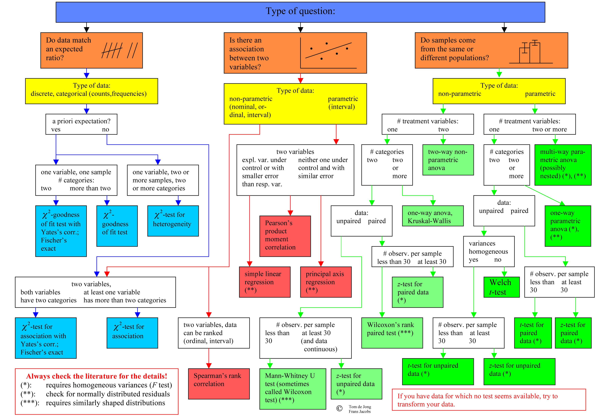

```{r setup, include=FALSE}
library(plyr)
library(tidyverse)
library(datasets)
library(kableExtra)
library(purrr)
library(scales)
library(forecast)
library(likert)
#library(gghighlight)
library(jmv)
options(htmltools.dir.version = FALSE)
knitr::opts_chunk$set(cache = FALSE, fig.align = "center", dev = "png", fig.retina = 2)
theme_set(theme_gray(base_size=16))

```


# Übersicht

1. .gray[Was sind Methoden?] => [Link](lecture01.html) $\checkmark$
2. .gray[Qualitative und Quantitative Daten? Forschungsfrage wählen] => [Link](lecture02.html) $\checkmark$
3. .gray[Wissenschaftstheorie, Empirie und Theorie] => [Link](lecture03.html) $\checkmark$
4. .gray[Forschungsintstrument entwickeln, Messtheorie, Skalenniveaus] => [Link](lecture04.html) $\checkmark$
5. .gray[Deskriptive Statistik, zentrale Tendenz und Streuung] => [Link](lecture05.html) $\checkmark$
6. .gray[Verteilungen, Stichproben und Wahrscheinlichkeit] => [Link](lecture06.html) $\checkmark$
7. .gray[Inferenz, Hypothesen, Fehler 1. und 2. Art, t-Test] => [Link](lecture07.html) $\checkmark$
8. .gray[Alpha-Fehler Kummulierung, ANOVA, MANOVA, Bonferroni] => [Link](lecture08.html) $\checkmark$
9. .gray[Zusammenhänge, Korrelation, lineare Regression] => [Link](lecture09.html) $\checkmark$
10. .gray[Skalen, Likert-Skalen, Reliabilität und Faktoren-Analyse] => [Link](lecture10.html) $\checkmark$
11. **Explorative Statistik, parametrische und nicht-parametrische Verfahren** => [Link](lecture11.html)
12. Conjoint-Verfahren, Cluster-Analyse => [Link](lecture12.html)
13. Effekt-Stärken und Poweranalyse => [Link](lecture13.html)

---
# Anwendung Statistik

## Deskriptive Statistik

## Inferenz Statistik

## Explorative Statistik

---
# Statistik

## Deskriptive Statistik
- Verfahren zur Beschreibung von Daten
- Tabellen, Abbildungen
- Lagemaße, Dispersionsmaße, Verteilungsmaße

--

## Inferenz Statistik
- Verfahren zur **Prüfung** von Hypothesen (NHST)
- Unterschiedshypothesen
  - t-Test, Varianzanalysen
- Zusammenhangshypothesen
  - Korrelation, lineare Regression
- Alpha-Fehler, $H_0$, $p$-Wert
- Vergleich mit Zufallsprozessen
- Übertragung von Stichprobe auf Grundgesamtheit

---
# Explorative Statistik

## Ziel: Entdecken von neuen Zusammenhängen oder Unterschieden
- Messen von vielen Parametern
- hypothesenfreie Suche nach statistischen Signifikanzen
- Durchführen von großen Mengen von Testsverfahren
- Korrelationstabellen, t-Tests, etc.
- Suchen von Strukturen in Daten: Strukturentdeckende Verfahren

--

## Welche Verfahren sind geeignet?
- Jedes Inferenzstatistische Verfahren, das viele Eingabeparameter erlaubt.
- Cluster-Analyse, explorative Faktorenanalyse (PCA oder EFA) 
- Visualisierungsverfahren

---
# Korrelationsmatrixplots

```{r corrplots, echo=FALSE}
library(corrplot)
d <- hcictools::robot_care
d %>% 
  select(starts_with("robo"), starts_with("huma")) %>% 
  hcictools::cor.matrix.plot()

```

---
# Korrelationsmatrixplots

```{r corrplots-2, echo=FALSE, message=FALSE}
library(corrplot)
library(hcictools)
d <- hcictools::robot_care


```

```{r corrplots-3}
d %>% 
  select(starts_with("robo")) %>% 
  hcictools::cor.matrix.plot()

```


---
# Small Multiples

```{r small-multiples, echo=FALSE, message=FALSE, warning=FALSE}

d %>% filter(gender!="keine Angabe") %>% 
  mutate(age_group = ntile(age, 3)) %>% 
  mutate(age_group = factor(age_group, labels = c("jung", "mittel", "alt"))) %>% 
  ggplot() + 
  aes(x=kut, y=robot_face) + 
  geom_jitter() + 
  geom_smooth(method="lm") + facet_grid(age_group~gender) + theme_minimal(base_size = 16) +
  labs(x="Kontrollüberzeugung im Umgang mit Technik", y="Akzeptanz robotischer Pflege: Gesichtspflege")

```


---
# k-Means Clustering

- Methoden zum Aufdecken von ähnlichen Probanden (Typologie)
- Man wählt die Anzahl an Klassen
- Algorithmus findet Klassenzugehörigkeit

## Iteratives Verfahren
- Schritt für Schritt Verbesserung
  1. Wähle Klassenmittelpunkt
  2. Wähle Zugehörige Daten/Probanden
  3. Wähle neuen Klassenmittelpunkt


## Visuelle Erklärung des Algorithmus
[https://www.naftaliharris.com/blog/visualizing-k-means-clustering/](https://www.naftaliharris.com/blog/visualizing-k-means-clustering/)


---
class: inverse, center, middle

# .yellow[Parametrische vs. nicht-parametrische Verfahren]

---
# Parametrische Verfahren
Bisherige Verfahren basieren auf der Verteilung der Daten
- t-Test setzt Normalverteilte Daten vorraus

Wir schätzen *Parameter* der Verteilung und vergleichen Daten mit idealen Verteilungen für Hypothesentests.
- Parameter: Mittelwert, Standardabweichung

## Wofür brauchen Verfahren Parameter?

--

- Nur mit Hilfe von Mittelwert und Standardabweichung, können wir prüfen wie, ob z.B. ein Mitelwertsunterschied groß genug ist, für ein signifikantes Ergebnis. 


Vorteil:
- Einfache Verfahren
- relativ robust gegen Verletzung der Vorraussetzung

---
# Nichtparametrische Verfahren
Nicht immer sind Parameter oder Verteilungen der Daten bekannt.
- Nicht-parametrische Verfahren setzen diese nicht vorraus.

## Beispiel:
- t-Test und Mann-Whitney U test
- Pearson und Spearman rank correlation
- lineare Regression und ordinale Regression
- ANOVA und Kruskal-Wallis Test


---
## Wann welcher Test?

---
# Tools zum Lernen oder Nachschlagen

Wann welche Methode?
- https://statkat.com (Englisch)
- https://www.methodenberatung.uzh.ch/de.html Methodenberatung Uni Zürich (SPSS)
- Andy Field 

Alternative Softwarelösungen zu R
- SPSS (Nachteil: Kosten, Reproducibility)
- Jamovi (Nachteil: kein Data Cleaning)
- JASP (Nachteil: Fokus auf Bayes'sche Statistik)
- Stata (Nachteil: Kosten)
- etc..
---
# Übersicht

1. .gray[Was sind Methoden?] => [Link](lecture01.html) $\checkmark$
2. .gray[Qualitative und Quantitative Daten? Forschungsfrage wählen] => [Link](lecture02.html) $\checkmark$
3. .gray[Wissenschaftstheorie, Empirie und Theorie] => [Link](lecture03.html) $\checkmark$
4. .gray[Forschungsintstrument entwickeln, Messtheorie, Skalenniveaus] => [Link](lecture04.html) $\checkmark$
5. .gray[Deskriptive Statistik, zentrale Tendenz und Streuung] => [Link](lecture05.html) $\checkmark$
6. .gray[Verteilungen, Stichproben und Wahrscheinlichkeit] => [Link](lecture06.html) $\checkmark$
7. .gray[Inferenz, Hypothesen, Fehler 1. und 2. Art, t-Test] => [Link](lecture07.html) $\checkmark$
8. .gray[Alpha-Fehler Kummulierung, ANOVA, MANOVA, Bonferroni] => [Link](lecture08.html) $\checkmark$
9. .gray[Zusammenhänge, Korrelation, lineare Regression] => [Link](lecture09.html) $\checkmark$
10. .gray[Skalen, Likert-Skalen, Reliabilität und Faktoren-Analyse => [Link](lecture10.html)] $\checkmark$
11. Explorative Statistik, parametrische und nicht-parametrische Verfahren => [Link](lecture11.html) $\checkmark$
12. Conjoint-Verfahren, Cluster-Analyse => [Link](lecture12.html) $\checkmark$
13. Effekt-Stärken und Poweranalyse => [Link](lecture13.html)